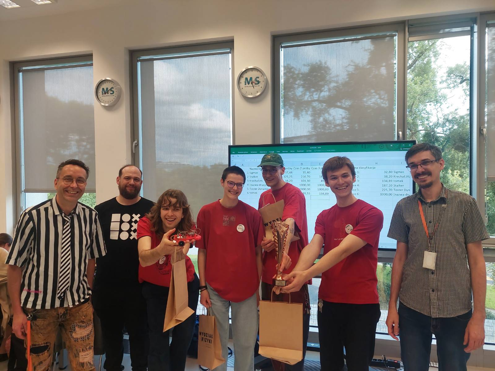

# tomek

## What is this?

This document summarizes our participation in [a line-follower competition](https://makerspace.uw.edu.pl/konkurs-line-follower-2024/) organized by Makerspace at the Faculty of Physics, University of Warsaw. Submitting this report is a requirement for passing the "Student Group Project" course.

> [!WARNING]
> We're going to include some non-technical details. It will probably be a fun read that brings back memories in a few years.

- [Competition rules](#competition-rules)
- [Our process](#our-process)
- [How to reproduce this robot](#how-to-reproduce-this-robot)
  - [3D model](#3d-model)
  - [Hardware](#hardware)
  - [Software](#software)
- [Takeaways](#takeaways)

## Competition rules

The goal was to build a robot that could follow a black line on a designated route ([Fig. 1](#fig-1)) as fast as possible.

<figure id="fig-1" align="center">
  
  <figcaption><i>Figure 1: Predefined route, black line on a white background</i></figcaption>
</figure>
  

The competition was open to all students, doctoral candidates, and employees of the University of Warsaw. Teams had to have a minimum of three and a maximum of five people. The budget was up to 165 EUR (btw. [in 2019 it was up to 120 EUR](https://makerspace.uw.edu.pl/konkurs-line-follower-2019/#:~:text=Ka%C5%BCda%20grupa%20b%C4%99dzie%20mia%C5%82a%20bud%C5%BCet%20w%20wysoko%C5%9Bci%20500%20z%C5%82%20do%20swojej%20dyspozycji.)). Each team had three attempts to complete the route, and the final score was the average of these three runs. A team was allowed to nudge the robot if it strayed from the line, but each nudge added five seconds to the run time. Of course, the fastest average score won.

## Our process

We are a team of five students. Initially, we agreed on consensus-based decision-making, a method for reaching group agreement by finding solutions that everyone actively supports, with no majority-style voting. [Read more about consensus here.](https://www.seedsforchange.org.uk/shortconsensus)

We established a few internal rules, the most prominent being that we operated on a voluntary basis - everything we did was for fun and learning. In other words, no one could require work from anyone, and we were all equal, regardless of the work completed.

We started with a git repository on GitHub and kanban board for tracking issues.

We held a three-hour meeting weekly where we went over the board, shared progress, and made decisions. This system worked for a while until we got busy with other university work and life dramas. We had selected the hardware components, printed an early version of the chassis, and written most of the code for the web UI and remote control. However, we hadn't touched the PID controller at all. At this point, we got bored and entered a procrastination phase.

Unfortunately, the competition judges rejected our idea to place neodymium magnets along the route as checkpoints to adjust controller parameters, which didn't help with our motivation.

After doing nothing for nearly two months, we completed 70% of the work in the last two days before the competition - including soldering, printing the final chassis, [vibe-coding](https://en.wikipedia.org/wiki/Vibe_coding) the PID, and tuning the algorithm.

This landed us 3rd place in the competition.

## How to reproduce this robot

We don't encourage anyone to do this.

### 3D model

Print the [models/chassis.stl](models/chassis.stl) model on your favorite 3D printer.

> [!IMPORTANT]
> You absolutely must use red filament for the chassis. If you use any other color, your robot will not work.

We sliced it with the [open-source PrusaSlicer](https://github.com/prusa3d/PrusaSlicer) software using the `0.20mm QUALITY @MK3` system preset, set the `Fill pattern` to `Gyroid` as a friend told us, and then printed it on an Original Prusa MK3S 3D printer.

### Hardware

Get the following components and solder them together according to the diagrams from the official documentation.

- [ESP32-WROOM-32](https://www.espressif.com/sites/default/files/documentation/esp32-wroom-32_datasheet_en.pdf)
- [QTR-8RC Reflectance Sensor Array](https://www.pololu.com/docs/0J12)
- [Pololu 30:1 Metal Gearmotor HP](https://www.pololu.com/product/1093)
- [DRV8833 Dual H-Bridge Motor Driver](https://www.ti.com/lit/ds/symlink/drv8833.pdf)
- [Solarbotics RW2i Wheel](https://solarbotics.com/product/rw2i/)
- [D24V6F5 5V, 600mA Step-Down Voltage Regulator](https://www.pololu.com/product/2107)
- [Dualsky 300mAh 2S 7.4V Li-Pol Battery](https://botland.com.pl/akumulatory-li-pol-2s-74v-/7876-pakiet-li-pol-dualsky-300mah-30c-2s-74v-6941047107403.html)

Stick them to the previously printed chassis somehow, or just keep them floating around as we did.

### Software

You can find the build instructions in [docs/how-to-build.md](https://github.com/tomekorg/van-binh-robot/blob/main/docs/how-to-build.md). Here's a high-level overview of the setup.

When the ESP32 boots, it sets up the logger, configures itself as a Wi-Fi access point, starts HTTP and WebSocket servers, and configures WebSocket queues before entering the core logic. The main loop includes a state machine that manages the robot's modes: `AUTO`, `MANUAL`, and `CALIBRATING`.

To control the robot remotely, connect to its Wi-Fi access point from any device and navigate to `http://192.168.1.22` in your browser to access the web interface. The web UI is built with HTML, CSS, and plain JavaScript, using the open-source [nipple.js](https://github.com/yoannmoinet/nipplejs) library for the joystick. It's all bundled with [Parcel](https://parceljs.org/). We didn't invest much in the design since it's not "customer-facing." However, that argument falls apart quickly when you peek at the physical robot.

<figure id="fig_2" align="center">
  
  <figcaption><i>Figure 2: Web interface</i></figcaption>
</figure>
  

By default, **tomek** is in `MANUAL` mode and can be driven by dragging the joystick from the marked area at the bottom of the screen. The joystick movements translate to [arcade drive](https://xiaoxiae.github.io/Robotics-Simplified-Website/drivetrain-control/arcade-drive/): the y-axis represents the robot's speed, and the x-axis is for steering.

Before switching to `AUTO` mode, which activates the adaptive PID controller, **tomek** must perform a calibration dance over the lightest and darkest surfaces; this is what the `Calibrate` button is for. We use the official [qtr-sensors-arduino library by Pololu](https://github.com/pololu/qtr-sensors-arduino/tree/master) to work with the sensors. Touching the joystick is enough to switch back to `MANUAL` mode and stop the robot.

There are input fields for changing various PID-related parameters in real-time. This real-time adjustment was the main reason for building the interface, as it dramatically speeds up the tuning process.

Lastly, there is a dark rectangle where we also display logs in real-time. We used FreeRTOS queues and threads to decouple the core algorithm logic from networking tasks, such as sending logs or other commands.

This is all built on the ESP-IDF framework because we wanted full control over the hardware. We plugged in the `espressif/arduino-esp32` library as an idf-component, which enabled us to use the Arduino API. It made the ESP-IDF a natural choice over the Arduino IDE.

## Takeaways

To our surprise, we delivered this project. For most of us, it was the first experience with git, 3D printing, soldering, a real C++ project, and microcontrollers. We burned two Li-Pol batteries.

We each reflected on one thing we learned and enjoyed from this experience. Each point below comes from a different team member.

> I discovered the ESP32 microcontroller. It was fascinating to learn how it works and to see just how many practical things can be built with it.

> I learned the value of a "just do it" approach. It's much better to build something imperfect to work with than to get stuck in endless discussions overthinking it from the start.

> I learned a personal lesson about recognizing and accepting my own limits. It's okay to contribute what you're capable of, without the pressure to do more.

> I found the most joy in the design process: from sketching ideas on paper and modeling them in Fusion 360 to assembling the physical product.

> For me, the journey was about starting from scratch. I appreciated learning the entire workflow - from electronics and wiring to coding and using git. I like that we managed to build something we previously knew nothing about.

<team photo, yet to be approved>

<!--  -->
